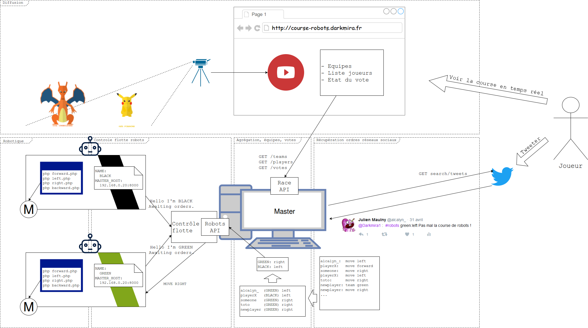

# DROP

Remotely control your RaspberryPi robot by sending him instructions on Twitter,
and win the race against the other robot.


## The story

There is a green and a black robot you can see from a webcam.
The goal of the bots is to go in the enemy's base before his enemy goes in his own base

You have to choose your robot, and make it win the race.

For that, just go on Twitter, and tweet to choose a robot, and control it.

But you're not alone, other people may choose the same robot as you.
So you're in fact in the green team or the black team.

Robots will do one move every turn of N seconds.
And they will do the most wanted move by people in the team.

In example, if most of the people on the green team tweeted to turn right,
the green robot will go right at the end of the turn. Then another turn begins.


## Drop project

We have chosen to do this project using PHP, for the fun.
We also use RaspberryPi for robots hardware.

It is a project to have fun and to prove that PHP can do more than websites.


## User functionnalities

User can interact with the race by:


   * Viewing the race in real-time with a webcam
   * Tweet every turn to choose a team and vote for a robot move

## Big picture

We are developing the project with microservices.




## Short description

Someone want to choose the green team and make his robot to turn right.

So he first tweets something like "I want to join green team #droprobot",
and "I want to turn right #droprobot"


   * Twitter

**Listen to tweets and send them to the drop system**

The Twitter microservice catch the tweets, and send to the master
that this exact player want to join team green and want to turn right.


   * Master

**Memorize the race state and trigger turns**

The master receive the data, store it, and broadcast the information so that to front can update the view.
The master also has to send to the fleet control API the most wanted move for black and green robot,
and this, every N seconds. Then, a new turn begins, and votes are reset.
Every player has to send a new order to his robot.


   * Fleet control

**Allow to control multiple robots with a RestAPI**

The fleet control receive the order that green must turn right,
so it send the message to the good robot.

   * Robotic

**Provide a low level API to control a single robot**

The fleet control calls the script `right.php`, with control the two servomotors.

   * Broadcasting

**The front of the project, display race webcam, and statistics**

A webcam broadcast the race in a web interface.
This web interface is also connected to the master to display real-time statistics.

## Long description

This section is detailled parts of implementation of drop microservices.


### Twitter observer

Responsible of:

   * reading any tweet about the race
   * parsing them to find which order the user wanted to say
   * Sending raw orders to the master API
   
**Interaction Observer -> User**

The user send a tweet, the format of the tweet is undetermined.
The service can find two type of orders:

   * the user choose a team
   * the user send a move to the robot of his team

**Interaction Observer -> Master**

The Master API will receive at any time one or many order.

At this time, the format can be:


   * for a player who choose a team

*Master API*
```
POST /api/orders

[ { "pseudo": "user_id", "team": "green" }]
```


   * for a player who send a move

*Master API*
```
POST /api/orders

`[ { "pseudo": "user_id", "move": "right" }]`
```

Many order can be sent simultaneously:

*Master API*
```
POST /api/orders

[
    { "pseudo": "user_id", "move": "right" },
    { "pseudo": "an_other_user_id", "move": "left" },
    { "pseudo": "john", "team": "black" }
]
```

An apiKey is required, and must be sent as query parameter:

`/api/orders?api_key=SecretAPIKey`


### Master

Responsible of:

   * persist the race state (players moves, teams, time before next turn)
   * store players moves
   * send most wanted move to fleet control api

**Interaction Master -> Fleet control**

The master has to send every N seconds the most wanted move to every robot.
The fleet control part provide an API, so the master send orders in JSON format:

*Fleet control API*
```
*POST /orders
*
*[
*    {"color": "green", "order": "forward"},
*    {"color": "black", "order": "right"}
*]
```


### Front

Responsible of:

   * Display race state: race webcam, teams, players, current votes, info "how to play"

**Interaction Front -> Master**

The master provide an API the front can request.
To get the current race state:

*Master API*
```
GET /api/race

{
    "teams": [
        {
            "id": 1,
            "name": "green",
            "players": [
                {
                    "id": 1,
                    "pseudo": "alcalyn_",
                    "vote": "left"
                }
            ]
        }
    ],
    "players_without_team": [
        {
            "id": 1,
            "pseudo": "toto",
            "vote": "right"
        }
    ],
    "vote_session": {
        "id": 1,
        "session_start": "2018-03-07T01:47:13+0000",
        "session_end": "2018-03-07T01:47:33+0000",
        "session_duration": 20
    }
}
```

To get this same data but in realtime, and avoid to `GET /api/race` every seconds to keep updated,
the master provide a websocket topic in which this same message is dispatched once something happened
(i.e someone sent an order, orders has been sent to robots then votes has been reset)

It is possible to connect to websocket topic with a WAMP v1 client.
Example in Javascript with Autobahn 0.8:

```
ab.connect('ws://master-ws:1234', callback);
```

See example in Master example page: <https://github.com/Darkmira/drop-master/blob/master/www/test-ws/index.html>
